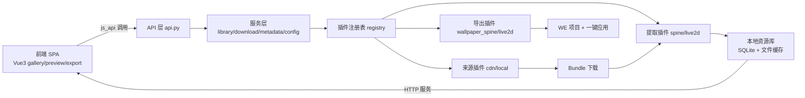

# 碧蓝航线动态壁纸工具 · 详细计划

> 状态：待评审。评审通过前不进入实现。
> 已定决策：Spine 动态立绘 + Live2D；资源全部自提取（官方 CDN/本地导入）；外壳 pywebview；前端 Vue 3；后端插件化模块设计。

## 1. 项目概述

一个 Windows 桌面工具：**自己**从碧蓝航线官方资源通道下载 AssetBundle，本地解包提取 **Spine 动态立绘** 与 **Live2D 皮肤**，在现代 Web UI 中预览，并导出为 Wallpaper Engine 壁纸项目（一键应用）。

### 1.1 范围

| 包含 | 说明 |
|---|---|
| Spine 动态立绘 | `spinepainting/`，含多骨架（`_T` 人物 / `_B` 背景 / `_M` 舰装）分层 |
| Live2D 皮肤 | `live2d/`，Cubism 3（moc3） |
| 预览 | 图鉴式列表 + 全屏预览（双引擎） |
| WE 导出 | Spine / Live2D 两套壁纸模板 + project.json + 预览 GIF |
| 本地导入 | 用户提供已解包资源文件夹 |

| 排除 | 原因 |
|---|---|
| 静态立绘（painting 碎片重组） | 用户明确不做 |
| 表情差分（paintingface） | 不属于动态立绘 |
| 第三方已提取资源仓库 | 用户明确不用 |
| 语音、互动、文本 | 超出壁纸工具范围 |

## 2. 术语

- **AssetBundle**：Unity 资源包，含 TextAsset / Texture2D / MonoBehaviour 等对象。
- **spinepainting**：动态立绘 Bundle 目录；一个皮肤可能拆成多个文件（多骨架）。
- **live2d**：Live2D 皮肤 Bundle 目录。
- **Spine 三件套**：`.skel`（骨骼/动画）+ `.atlas`（图集描述）+ 贴图 PNG。
- **Cubism 模型**：`.moc3` + `model3.json` + 贴图 + `motion3.json` + `exp3.json`。
- **hash CSV**：官方资源清单（文件名/哈希/大小），用于差分更新。
- **多骨架**：同一直绘拆成多套 Spine 骨骼分层渲染（人物/背景/舰装）。
- **插件**：实现统一接口、可被注册表自动发现的功能单元（来源/提取/导出）。

## 3. 总体架构

### 3.1 技术栈（已定）

**外壳**：pywebview + WebView2（Windows 原生 WebView）

**前端**（现代 UI 的来源）：
- Vue 3 + Vite + Naive UI（深色主题、毛玻璃、动效）
- Spine 预览：spine-ts 3.8 WebGL 运行时（碧蓝 spine 3.899）
- Live2D 预览：Cubism Web SDK
- 开发模式：Vite 热更新在浏览器写 UI；生产模式：打包后由 pywebview 加载

**后端**（Python 3.12，插件化）：
- `UnityPy`：AssetBundle 解包
- Live2D 转换：借鉴 `UnityPyLive2DExtractor`（TypeTree 思路）
- 网络：`requests` + 原生 `socket`（TCP 握手）
- 图片：`Pillow`；存储：SQLite（`library.db`）
- 本地资源 HTTP 服务：`ThreadingHTTPServer`（127.0.0.1 随机端口，解决 file:// 跨域问题，沿用既有方案）

### 3.2 分层与数据流



### 3.3 通信与事件

- 前端调用：`window.pywebview.api.xxx()`（异步 Promise）
- 后端推送（下载/提取进度）：事件总线 → `window.evaluate_js` 调用前端注册的回调
- 大任务（下载/解包/提取/导出）全部放 worker 线程，UI 不阻塞

## 4. 模块化与插件机制

这是"随时新增功能"的核心，两个平面：

### 4.1 后端插件

`plugins/` 下按类别放独立包，每个插件实现统一接口并声明 `manifest.json`：

```
plugins/
├── sources/
│   ├── cdn/manifest.json + source.py
│   └── local/manifest.json + source.py
├── extractors/
│   ├── spine/
│   └── live2d/
└── exporters/
    ├── wallpaper_spine/
    └── wallpaper_live2d/
```

`registry.py` 启动时扫描 `plugins/`，校验 manifest，按接口加载，向 API 层暴露插件清单。**新增功能 = 放一个新插件文件夹**，核心代码零改动。

插件接口草案：

```python
class SourcePlugin:      # list_bundles() / download(bundle) / progress
class ExtractorPlugin:   # extract(bundle_path, out_dir) -> ExtractedSkin
class ExporterPlugin:    # export(skin, options, out_dir) -> WallpaperProject
```

### 4.2 前端模块

前端 `src/features/` 下每个功能一个模块（gallery / preview / export / settings），各自带路由、组件、状态；通过 `bridge/` 统一调用后端 API。前端也有一个轻量注册表，把"菜单项/路由"与后端插件 id 对应，后端出现新插件时前端模块补一个入口即可。

### 4.3 模块化验收标准

做到"往 `plugins/exporters/` 加一个最小的第三导出插件（如静态海报），不修改核心代码，前端菜单自动出现入口"。

## 5. 资源获取（下载器）

### 5.1 官方 CDN 协议（已查证）

1. **TCP 握手**：向登录服务器发送固定十六进制报文（参考实现为 `000a002a300000083d120130`），响应含 hash 文件标识。
2. **拉取 hash CSV**：拼 URL 下载资源清单。
3. **解析**：CSV 含 `spinepainting/*`、`live2d/*` 等文件名/哈希/大小。
4. **差分**：对比本地清单，只下载新增/变更。
5. **下载**：从 CDN 拉 AssetBundle。

实现：自行实现协议，参考公开逆向结论；M0 用参考源码 + 实测双重确认后写入 `docs/protocol/`。

### 5.2 下载器能力

- 断点续传（`.part` + Range）、并发、重试、限速、完整性校验
- 进度事件推送前端
- 代理设置

### 5.3 本地导入

- 游戏目录扫描（`Android/data/com.bilibili.azurlane/files/AssetBundles`）或已解包文件夹
- 导入后走同一套"识别 → 索引 → 预览"流程

## 6. 解包与提取

### 6.1 通用

UnityPy 打开 Bundle → 按类型导出：`TextAsset`（.skel/.atlas/.moc3/JSON）、`Texture2D`（转 PNG）、`MonoBehaviour`（Cubism TypeTree）。

### 6.2 Spine 提取

- 输入 `spinepainting/{name}`；多骨架按 `_T/_B/_M` 分组
- 输出三件套 + 层级配置
- M0 验证项：贴图是否同 Bundle、`.atlas` 贴图名一致性、是否依赖额外依赖包

### 6.3 Live2D 提取

- 输入 `live2d/{name}`；输出标准 Cubism 模型目录
- 基于 TypeTree 解析（UnityPyLive2DExtractor 思路），TypeTree 可随版本更新
- 已知坑：部件不显示/动作错乱/Viewer 兼容 → 以 Cubism Web SDK 实测为准，必要时修 model3.json 引用与 moc3 文件头

### 6.4 校验

提取后记录：类型/版本/文件清单/哈希/预览是否通过；失败单独标记，不影响其他皮肤。

## 7. 元数据（待确认决策点）

- **方案 A（推荐）**：舰船/皮肤文本数据用社区整理 JSON（AzurLaneData，自动更新）
- **方案 B**：连元数据也自己从游戏 Lua 提取（彻底但成本高）

索引 Schema 草案：

```
ships(id, group_id, name_zh, name_en, faction, rarity, hull_type)
skins(id, ship_group, name_zh, skin_type, painting, has_spine, has_live2d)
assets(id, skin_id, kind, bundle_name, part, local_path, status, checksum)
```

## 8. 本地资源库

```
resources/
├── bundles/          # AssetBundle
├── extracted/        # spine/ live2d/ 提取产物
├── thumbnails/       # 预览缩略图
└── library.db
```

预览资源通过本地 HTTP 服务访问（127.0.0.1 随机端口），避免 file:// 的跨域问题。

## 9. 前端 UI（Vue 3）

### 9.1 页面

1. **图鉴列表页**：左侧筛选栏（搜索/阵营/舰种/类型/下载状态）+ 卡片流
2. **详情预览页**：全屏画布（Spine/Cubism 双引擎二选一）、皮肤切换条、控制栏（动画/表情/拖拽缩放）、背景样式（纯色/渐变/取色/毛玻璃/星空）、导出入口
3. **导出抽屉**：参数滑块、进度、完成后"在 WE 打开"
4. **设置页**：代理、并发数、缓存管理、插件列表

### 9.2 视觉

深色主题 + Naive UI + 毛玻璃卡片 + 骨架屏 + 动效；组件统一由组件库提供，保证一致性与可维护性。

### 9.3 开发工作流

- 开发：`npm run dev`（Vite HMR）+ 后端以调试模式启动，pywebview 加载 dev URL
- 生产：`npm run build` → pywebview 加载 `frontend/dist`

## 10. Wallpaper Engine 导出

### 10.1 通用结构

```
{skin}_wallpaper/
├── index.html + project.json + preview.gif
├── assets/          # 皮肤资源 + 引擎运行时（本地打包，不依赖在线 CDN）
└── config.js        # 层级/动画/参数默认值
```

`project.json` 属性：缩放/水平偏移/垂直偏移/对齐方式/背景样式。

### 10.2 Spine 模板

spine-ts 3.8 + 三件套 + 多骨架分层；默认动画 normal/idle，可选动画做成下拉属性。

### 10.3 Live2D 模板

Cubism Web 运行时 + 模型目录；属性可映射模型参数。注意 Cubism Core 许可条款（本地分发，与社区常见做法一致）。

### 10.4 预览 GIF 捕获

- 首选：隐藏 pywebview 窗口（屏幕外）加载壁纸页 → JS 逐帧 `canvas.toDataURL` 50 帧 → Pillow 合成 GIF
- 兜底：静态 `preview.png`（GIF 捕获不可用时保证预览不空白）

### 10.5 一键应用

沿用 we-cli 流程：定位 WE 目录 → 复制项目到 `projects/myprojects/` → `-control openWallpaper -file index.html`；编辑器 `-window editor -project project.json`。

## 11. 完整目录结构

```
azurlane-dynamic-wallpaper/
├── docs/                    # 计划、协议笔记、M0 报告
├── backend/
│   ├── main.py              # 薄入口：装配 + 启动窗口
│   ├── app.py               # 应用装配：注册插件、初始化服务
│   ├── api.py               # WebApi（前端 js_api）
│   ├── core/
│   │   ├── registry.py      # 插件注册表
│   │   ├── events.py        # 事件总线（进度推送）
│   │   ├── http_server.py   # 本地资源 HTTP 服务
│   │   ├── library.py       # SQLite 索引
│   │   ├── downloader.py    # 并发下载/续传
│   │   ├── handshake.py     # TCP 握手
│   │   ├── hash_csv.py      # 清单解析/差分
│   │   ├── metadata.py      # 元数据
│   │   └── config.py
│   └── plugins/
│       ├── sources/cdn/  sources/local/
│       ├── extractors/spine/  extractors/live2d/
│       └── exporters/wallpaper_spine/  exporters/wallpaper_live2d/
├── frontend/
│   ├── src/
│   │   ├── main.js / App.vue
│   │   ├── features/gallery / preview / export / settings
│   │   ├── components/
│   │   ├── bridge/          # pywebview 通信封装
│   │   └── registry.js      # 前端功能注册表
│   ├── vite.config.js
│   └── package.json
├── tools/                    # 开发脚本（M0 用）
├── resources/                # 运行期数据（.gitignore）
├── tests/
└── requirements.txt
```

## 12. 里程碑与验收标准

### M0 · 骨架 + 提取链路 PoC

任务：
1. 搭建 backend/frontend 骨架：薄入口、注册表、Vue 3 + Vite + Naive UI 空壳（前端能调通 `ping`）
2. 协议笔记：握手报文、hash CSV 格式（参考源码 + 实测）；最小握手+清单解析脚本
3. 下载样例：1 个多骨架 spinepainting Bundle、1 个 live2d Bundle
4. UnityPy 提取 Spine 三件套 → spine-ts 3.8 页面预览成功（多骨架层级正确）
5. 提取 Live2D → Cubism Web SDK 预览成功（含动作）
6. 核对 bundle 名 ↔ 元数据字段映射
7. 输出 `docs/m0-report.md`

验收：3/4/5 实测通过；骨架可运行；新增一个最小插件可被注册表发现。

### M1 · 下载器 + 索引 + 图鉴

- 正式下载器（并发/续传/差分/代理/进度事件）
- 元数据入库（方案 A 或 B）、图鉴列表页、详情预览页（双引擎 + 背景样式）
- 验收：浏览全部皮肤；点击已下载皮肤 5 秒内出预览；下载新皮肤全流程不卡 UI

### M2 · WE 导出

- 两套模板 + project.json + GIF 捕获 + 一键应用/编辑器
- 验收：随机 3 个 Spine、3 个 Live2D 皮肤导出，WE 应用成功、预览正常、滑块生效

### M3 · 完善与发布

- 批量下载、更新检查、异常收集、PyInstaller 打包、GitHub Release
- 验收：新机器解压即用；增量更新正常

## 13. 性能策略

- 下载/解包/提取/导出全部 worker 线程，UI 线程只做渲染
- 缩略图生成 + 懒加载；SQLite 索引查询
- 提取结果缓存（相同 bundle 哈希不重复提取）

## 14. 风险与对策

| 风险 | 影响 | 对策 |
|---|---|---|
| CDN 协议随版本变化 | 下载器失效 | 协议文档化 + 实测样本留存 + 跟进参考实现 |
| Live2D 提取兼容性 | 部分皮肤失败 | 提取后自动校验；TypeTree 可更新；失败单独标记 |
| Spine 跨 Bundle 依赖 | 提取不全 | M0 专项验证 |
| 国内直连官方服务器慢 | 下载体验差 | 代理 + 续传 + 并发 |
| GIF 捕获不稳定 | 导出预览空白 | 静态 preview.png 兜底 |
| 第三方库许可 | 分发受限 | 实现前逐一确认（UnityPy、spine-ts、Cubism Core 等） |

## 15. 合规说明

- 只从游戏官方通道拉取资源并在本地处理；不内置、不上传、不分发游戏素材
- 元数据若用社区 JSON，仅为文本数据
- 提醒用户遵守游戏服务条款；定位为个人学习与壁纸创作工具

## 16. 待确认决策点

1. **元数据来源**：方案 A（社区 JSON，推荐）还是方案 B（全自提取）？
2. 前端 JS 起步（推荐）还是 TypeScript？
3. 项目位置/名称保留 `w/azurlane-dynamic-wallpaper/`？
4. 首发优先角色/皮肤（便于 M0 选样例）？
5. 是否需要批量导出（M3 已预留）？
